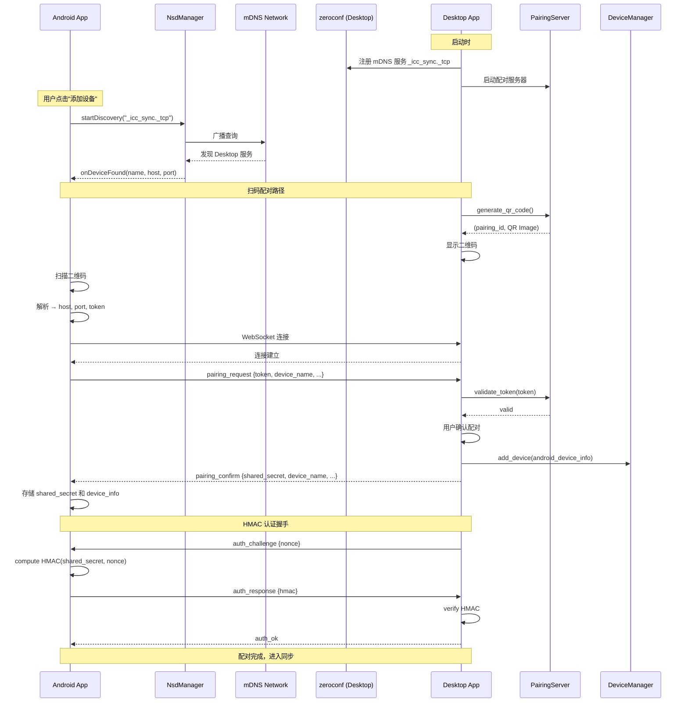
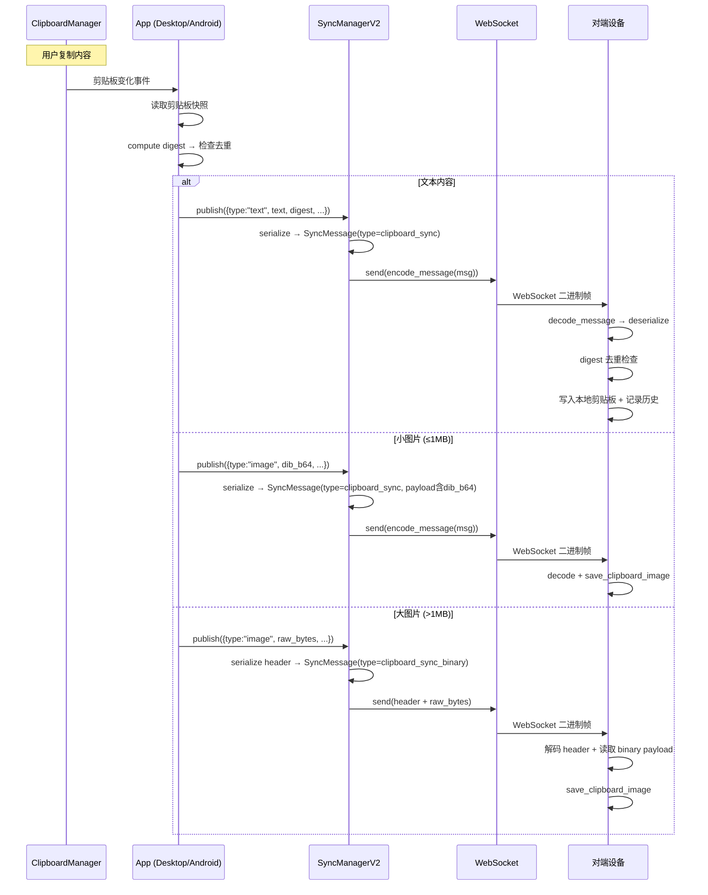
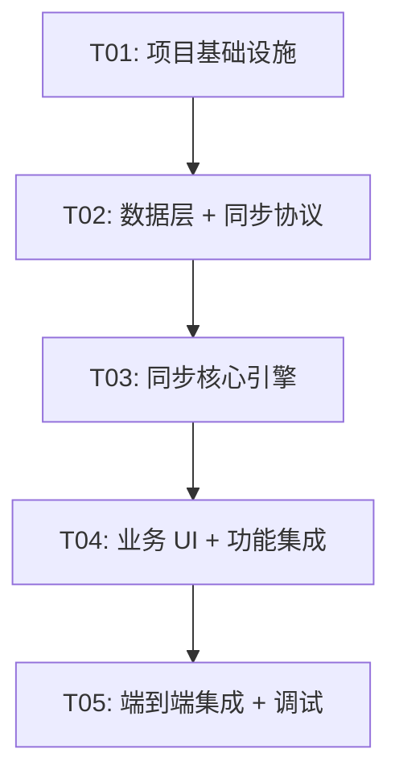

# 截图剪切板工具 — Android 适配 + 多设备同步系统架构设计

> 架构师：高见远（Gao） | 版本：1.0 | 日期：2025-07

---

## 目录

- [Part A：系统设计](#part-a系统设计)
  - [1. 实现方案与框架选型](#1-实现方案与框架选型)
  - [2. 文件列表](#2-文件列表)
  - [3. 数据结构与接口（类图）](#3-数据结构与接口类图)
  - [4. 程序调用流程（时序图）](#4-程序调用流程时序图)
  - [5. 待明确事项](#5-待明确事项)
- [Part B：任务分解](#part-b任务分解)
  - [6. 依赖包列表](#6-依赖包列表)
  - [7. 任务列表](#7-任务列表)
  - [8. 共享知识](#8-共享知识)
  - [9. 任务依赖图](#9-任务依赖图)

---

## Part A：系统设计

### 1. 实现方案与框架选型

#### 1.1 核心技术挑战

| 挑战 | 说明 |
|------|------|
| **同步协议升级** | 现有 `ClipboardSyncManager` 使用 TCP + JSON 行协议（1对1点对点），需升级为 WebSocket 多对多。需兼容现有 `serialize_item_for_sync` / `deserialize_synced_item` 序列化逻辑 |
| **多设备管理** | 从单 peer_host + 单端口连接升级为多设备同时在线（≤5台），需设备注册、配对认证、连接生命周期管理 |
| **Android 原生截屏** | MediaProjection API 需用户授权，且 Android 10+ 需前台 Service 配合；截屏后需转为 Bitmap 供编辑器使用 |
| **Android 剪贴板监听** | Android 10+ 后台读取剪贴板受限，需前台 Service + `OnPrimaryClipChangedListener`，且仅能读取文本剪贴板 |
| **跨平台图片编辑器** | 桌面端用 Tkinter Canvas 实现编辑器，Android 端需用 Kotlin Canvas 全新实现画笔/文字/箭头/马赛克/裁剪 |
| **局域网设备发现** | 桌面端需广播 mDNS 服务，Android 端需扫描发现；跨网段时需退化到手动输入 |
| **中转服务器** | 跨网络同步需要信令服务器协调 WebSocket 连接，数据量大时需 TURN 中继 |
| **配对安全** | 需在局域网内实现扫码/PIN 配对，自动交换 shared_secret，后续连接 HMAC 认证 |

#### 1.2 整体架构

```
┌──────────────────────────────────────────────────────────────────────┐
│                        云端中转层 (P2)                                │
│  ┌─────────────────────────────────────────────────────────────────┐ │
│  │  Relay Server (Python)                                          │ │
│  │  WebSocket 信令 + TURN 中继 + 设备注册表                        │ │
│  └───────────┬─────────────────────────────┬───────────────────────┘ │
└──────────────┼─────────────────────────────┼─────────────────────────┘
               │ (跨网络时)                   │ (跨网络时)
┌──────────────┼─────────────────────────────┼─────────────────────────┐
│              │      局域网直连层 (P0)       │                         │
│  ┌───────────▼──────────┐      ┌───────────▼──────────┐              │
│  │   Desktop App        │      │   Android App        │              │
│  │   (Python/Tkinter)   │◄────►│   (Kotlin)           │              │
│  │                      │  WS  │                      │              │
│  │  ┌────────────────┐  │      │  ┌────────────────┐  │              │
│  │  │SyncManagerV2   │  │      │  │SyncClient      │  │              │
│  │  │(WebSocket)     │  │      │  │(WebSocket)     │  │              │
│  │  └───────┬────────┘  │      │  └───────┬────────┘  │              │
│  │          │           │      │          │           │              │
│  │  ┌───────▼────────┐  │      │  ┌───────▼────────┐  │              │
│  │  │mDNS Advertiser│  │      │  │NsdManager      │  │              │
│  │  │(zeroconf)     │  │      │  │(Android NSD)   │  │              │
│  │  └───────────────┘  │      │  └────────────────┘  │              │
│  │                      │      │                      │              │
│  │  ┌────────────────┐  │      │  ┌────────────────┐  │              │
│  │  │PlatformAdapter │  │      │  │MediaProjection │  │              │
│  │  │Clipboard/Hotkey│  │      │  │ClipboardMgr    │  │              │
│  │  └────────────────┘  │      │  │ForegroundSvc   │  │              │
│  └──────────────────────┘      │  └────────────────┘  │              │
│                                 └──────────────────────┘              │
└──────────────────────────────────────────────────────────────────────┘
```

**架构模式**：
- **桌面端**：在现有 `ClipboardSyncManager` 基础上重构为 `SyncManagerV2`，WebSocket 多连接管理
- **Android 端**：Kotlin 原生，MVVM + Repository 模式，Jetpack Compose UI
- **中转服务器**：Python asyncio + websockets，无状态信令 + 有状态连接管理
- **协议层**：WebSocket 二进制帧（消息头 JSON + 可选二进制负载），兼容现有序列化逻辑

#### 1.3 框架与库选型

##### Android 端

| 能力 | 选型 | 理由 |
|------|------|------|
| **UI 框架** | **Jetpack Compose** | Android 现代声明式 UI，代码量少、状态管理清晰、Material 3 内建 |
| **网络/WebSocket** | **OkHttp** | 成熟稳定、WebSocket 支持完善、Kotlin 协程友好 |
| **异步/并发** | **Kotlin Coroutines + Flow** | Android 官方推荐，结构化并发，替代 RxJava |
| **依赖注入** | **Hilt** | 基于 Dagger，编译期注入，Android 官方推荐 |
| **图片编辑** | **自研 Canvas 编辑器** | 无轻量第三方库满足需求（画笔/文字/箭头/马赛克/裁剪），基于 Android Canvas API 自研 |
| **截屏** | **MediaProjection API** | Android 原生截屏 API，需配合前台 Service |
| **剪贴板** | **ClipboardManager + OnPrimaryClipChangedListener** | Android 原生 API |
| **mDNS 发现** | **NsdManager** | Android 原生 NSD 服务，零额外依赖 |
| **图片加载** | **Coil** | Kotlin-first 图片加载库，Compose 集成好 |
| **数据存储** | **Room** | Android 原生 SQLite ORM，LiveData/Flow 集成 |
| **权限管理** | **Accompanist Permissions** | Compose 权限请求辅助库 |
| **导航** | **Compose Navigation** | Jetpack 官方 Compose 导航库 |

##### 桌面端（Python）

| 能力 | 选型 | 理由 |
|------|------|------|
| **WebSocket 服务端/客户端** | **websockets** (Python) | asyncio 原生、API 简洁、维护活跃、支持服务端和客户端 |
| **mDNS 广播** | **zeroconf** | Python 最成熟的 mDNS 库，支持注册和发现 |
| **二维码生成** | **qrcode** (Pillow 后端) | 配对时生成二维码，轻量纯 Python |

##### 中转服务器（Python）

| 能力 | 选型 | 理由 |
|------|------|------|
| **WebSocket 服务器** | **websockets** | 同桌面端，保持一致 |
| **HTTP API** | **FastAPI** | 轻量高性能，asyncio 原生，自动生成 API 文档 |
| **数据存储** | **SQLite (aiosqlite)** | 轻量、零运维、设备注册表和配对信息持久化 |

### 2. 文件列表

#### 2.1 Android 端（独立项目）

```
android/
├── build.gradle.kts                          # 项目根构建配置
├── settings.gradle.kts                        # Gradle 设置
├── gradle.properties                         # Gradle 属性
├── gradle/
│   └── wrapper/
│       ├── gradle-wrapper.jar
│       └── gradle-wrapper.properties
├── app/
│   ├── build.gradle.kts                      # App 模块构建配置
│   ├── proguard-rules.pro
│   └── src/
│       └── main/
│           ├── AndroidManifest.xml
│           ├── java/com/integratedcaptureclipboard/android/
│           │   ├── ICApplication.kt                  # Application 类 (Hilt 入口)
│           │   ├── MainActivity.kt                    # 主 Activity
│           │   ├── di/
│           │   │   ├── AppModule.kt                    # 全局 DI 模块
│           │   │   ├── NetworkModule.kt               # 网络 DI 模块
│           │   │   └── DatabaseModule.kt              # 数据库 DI 模块
│           │   ├── data/
│           │   │   ├── db/
│           │   │   │   ├── AppDatabase.kt             # Room 数据库定义
│           │   │   │   ├── ClipboardItemEntity.kt    # 剪贴板历史 Entity
│           │   │   │   ├── ClipboardItemDao.kt        # 剪贴板历史 DAO
│           │   │   │   ├── DeviceEntity.kt           # 配对设备 Entity
│           │   │   │   └── DeviceDao.kt              # 配对设备 DAO
│           │   │   ├── repository/
│           │   │   │   ├── ClipboardRepository.kt    # 剪贴板数据仓库
│           │   │   │   └── DeviceRepository.kt       # 设备数据仓库
│           │   │   └── model/
│           │   │       ├── SyncMessage.kt            # 同步消息数据类
│           │   │       ├── DeviceInfo.kt             # 设备信息数据类
│           │   │       └── PairingInfo.kt            # 配对信息数据类
│           │   ├── service/
│           │   │   ├── ClipboardMonitorService.kt    # 前台 Service：剪贴板监听
│           │   │   └── SyncService.kt                # 前台 Service：同步连接保活
│           │   ├── sync/
│           │   │   ├── WebSocketClient.kt             # WebSocket 客户端封装
│           │   │   ├── SyncManager.kt                # 同步管理器（连接/认证/收发）
│           │   │   ├── SyncSerializer.kt             # 同步消息序列化/反序列化
│           │   │   ├── DeviceAuthenticator.kt        # 设备认证（HMAC）
│           │   │   └── NsdDiscovery.kt               # mDNS 设备发现
│           │   ├── screenshot/
│           │   │   ├── MediaProjectionManager.kt     # MediaProjection 生命周期管理
│           │   │   ├── ScreenCapturer.kt              # 截屏捕获
│           │   │   └── editor/
│           │   │       ├── ImageEditorScreen.kt      # 图片编辑器 Compose Screen
│           │   │       ├── EditorCanvas.kt            # 编辑画布 Composable
│           │   │       ├── EditorTool.kt              # 编辑工具枚举
│           │   │       ├── EditorState.kt             # 编辑器状态
│           │   │       ├── tools/
│           │   │       │   ├── PenTool.kt             # 画笔工具
│           │   │       │   ├── TextTool.kt            # 文字工具
│           │   │       │   ├── ArrowTool.kt          # 箭头工具
│           │   │       │   ├── RectTool.kt            # 矩形工具
│           │   │       │   ├── MosaicTool.kt         # 马赛克工具
│           │   │       │   └── CropTool.kt            # 裁剪工具
│           │   │       └── ImageSaver.kt             # 图片保存
│           │   ├── clipboard/
│           │   │   ├── ClipboardMonitor.kt            # 剪贴板变化监听器
│           │   │   └── ClipboardHelper.kt             # 剪贴板读写辅助
│           │   └── ui/
│           │       ├── navigation/
│           │       │   └── AppNavigation.kt           # Compose Navigation 图
│           │       ├── theme/
│           │       │   ├── Theme.kt                   # Material 3 主题
│           │       │   └── Color.kt                   # 颜色定义
│           │       ├── clipboard/
│           │       │   ├── ClipboardScreen.kt         # 剪贴板历史页面
│           │       │   └── ClipboardViewModel.kt     # 剪贴板历史 ViewModel
│           │       ├── screenshot/
│           │       │   ├── ScreenshotScreen.kt        # 截图页面
│           │       │   └── ScreenshotViewModel.kt     # 截图 ViewModel
│           │       ├── sync/
│           │       │   ├── SyncScreen.kt              # 同步页面
│           │       │   ├── SyncViewModel.kt           # 同步 ViewModel
│           │       │   ├── DeviceCard.kt              # 设备卡片 Composable
│           │       │   └── PairingDialog.kt           # 配对对话框
│           │       └── components/
│           │           ├── BottomNavBar.kt            # 底部导航栏
│           │           ├── ClipboardItemCard.kt       # 剪贴板记录卡片
│           │           └── SearchBar.kt               # 搜索栏
│           └── res/
│               ├── values/
│               │   ├── strings.xml
│               │   ├── colors.xml
│               │   └── themes.xml
│               ├── drawable/
│               │   └── ic_notification.xml           # 通知栏图标
│               └── mipmap-*/                          # 应用图标
```

#### 2.2 桌面端新增/修改文件

| 相对路径 | 类型 | 说明 |
|---------|------|------|
| `src/sync/` | 新增目录 | 新同步模块 |
| `src/sync/__init__.py` | 新增 | 模块初始化 |
| `src/sync/sync_manager_v2.py` | 新增 | WebSocket 多设备同步管理器 |
| `src/sync/websocket_server.py` | 新增 | WebSocket 服务端（接受 Android 连入） |
| `src/sync/websocket_client.py` | 新增 | WebSocket 客户端（连接其他桌面端/中转） |
| `src/sync/device_manager.py` | 新增 | 设备注册/配对/认证管理 |
| `src/sync/mdns_advertiser.py` | 新增 | mDNS 服务广播 |
| `src/sync/protocol.py` | 新增 | 消息协议定义（消息类型、编解码） |
| `src/sync/pairing_server.py` | 新增 | 配对 HTTP 服务器（生成二维码、PIN） |
| `src/clipboard_viewer.py` | 修改 | 将 `ClipboardSyncManager` 替换为 `SyncManagerV2`；同步设置 UI 升级 |
| `src/integrated_tool/app.py` | 修改 | 同步/设置 Tab 中增加设备管理 UI；增加二维码显示功能 |
| `requirements.txt` | 修改 | 添加 websockets、zeroconf、qrcode 依赖 |
| `pyproject.toml` | 修改 | 添加新依赖声明 |

#### 2.3 中转服务器文件

| 相对路径 | 类型 | 说明 |
|---------|------|------|
| `relay_server/` | 新增目录 | 中转服务器项目 |
| `relay_server/requirements.txt` | 新增 | Python 依赖 |
| `relay_server/server.py` | 新增 | FastAPI + WebSocket 主入口 |
| `relay_server/signaling.py` | 新增 | WebSocket 信令处理（设备注册、连接转发） |
| `relay_server/turn_relay.py` | 新增 | TURN 中继转发（大文件/图片数据转发） |
| `relay_server/device_registry.py` | 新增 | 设备注册表（在线状态、配对关系） |
| `relay_server/auth.py` | 新增 | 认证逻辑（HMAC 校验、Token 验证） |
| `relay_server/config.py` | 新增 | 服务器配置 |
| `relay_server/Dockerfile` | 新增 | Docker 部署文件 |

### 3. 数据结构与接口（类图）

```mermaid
classDiagram
    direction TB

    class SyncMessage {
        <<data class>>
        +type: str
        +origin: str
        +timestamp: str
        +payload: dict
        +to_json() str
        +from_json(raw: str)$ SyncMessage
    }

    class DeviceInfo {
        <<data class>>
        +device_id: str
        +device_name: str
        +device_type: str
        +ip_address: str
        +port: int
        +platform: str
        +paired_at: str
        +last_seen: str
    }

    class PairingInfo {
        <<data class>>
        +pairing_id: str
        +host: str
        +port: int
        +token: str
        +expires_at: float
        +to_qr_text() str
    }

    class SyncConfig {
        <<data class>>
        +enabled: bool
        +listen_host: str
        +port: int
        +shared_secret: str
        +sync_text: bool
        +sync_images: bool
        +sync_files: bool
        +lan_only: bool
        +relay_url: str
    }

    class SyncManagerV2 {
        -config: SyncConfig
        -device_manager: DeviceManager
        -ws_server: WebSocketServer
        -ws_clients: dict
        -mdns: MdnsAdvertiser
        -event_queue: Queue
        -node_id: str
        -_stop_event: Event
        +start() None
        +stop() None
        +publish(item: dict) None
        +get_connected_devices() list
        +connect_to_device(device: DeviceInfo) None
        +disconnect_device(device_id: str) None
        -_on_client_connected(ws, device_id) None
        -_on_client_disconnected(device_id) None
        -_on_message(device_id, message) None
        -_broadcast(message, exclude) None
        -_run_auth_handshake(ws) str
    }

    class WebSocketServer {
        -host: str
        -port: int
        -connections: dict
        +start() None
        +stop() None
        +broadcast(data: bytes, exclude: set) None
        +send(device_id: str, data: bytes) None
        -_handler(ws) None
    }

    class WebSocketClient {
        -url: str
        -ws: WebSocketClientProtocol
        -reconnect_interval: float
        +connect() None
        +disconnect() None
        +send(data: bytes) None
        +is_connected() bool
        -_recv_loop() None
        -_reconnect_loop() None
    }

    class DeviceManager {
        -devices: dict
        -config_path: Path
        +load() None
        +save() None
        +add_device(device: DeviceInfo) None
        +remove_device(device_id: str) None
        +get_device(device_id: str) DeviceInfo
        +list_devices() list
        +update_last_seen(device_id: str) None
        +is_paired(device_id: str) bool
    }

    class DeviceAuthenticator {
        +generate_challenge() str
        +compute_hmac(secret: str, challenge: str) str
        +verify_hmac(secret: str, challenge: str, response: str) bool
        +generate_pairing_token() str
    }

    class MdnsAdvertiser {
        -service_type: str
        -port: int
        -info: ServiceInfo
        +start(device_name: str, port: int) None
        +stop() None
    }

    class PairingServer {
        -host: str
        -port: int
        -active_tokens: dict
        +start() None
        +stop() None
        +generate_qr_code() Tuple~str, Image~
        +generate_pin() str
        +validate_token(token: str) bool
    }

    class ProtocolCodec {
        <<static>>
        +encode_message(msg: SyncMessage) bytes
        +decode_message(data: bytes) SyncMessage
        +encode_clipboard_item(item: dict, config: SyncConfig) bytes
        +decode_clipboard_item(data: bytes, config: SyncConfig) dict
    }

    %% Android 端核心类
    class AndroidSyncManager {
        -wsClient: OkHttpWebSocket
        -nsdDiscovery: NsdDiscovery
        -deviceRepo: DeviceRepository
        -clipboardRepo: ClipboardRepository
        -nodeId: String
        +startDiscovery() None
        +stopDiscovery() None
        +connectToDevice(device: DeviceInfo) None
        +disconnectDevice(deviceId: String) None
        +publishClipboardItem(item: ClipboardItemEntity) None
        -onMessageReceived(message: SyncMessage) None
        -runAuthHandshake(ws: WebSocket) String
    }

    class AndroidWebSocketClient {
        -okHttpClient: OkHttpClient
        -activeConnections: Map~String, WebSocket~
        +connect(url: String, listener: WebSocketListener) WebSocket
        +disconnect(deviceId: String) None
        +send(deviceId: String, data: ByteString) Boolean
        +broadcast(data: ByteString, exclude: Set~String~) None
    }

    class NsdDiscovery {
        -nsdManager: NsdManager
        -discoveryListener: NsdManager.DiscoveryListener
        +startDiscovery(serviceType: String) None
        +stopDiscovery() None
        +setOnDeviceFoundListener(listener: OnDeviceFoundListener) None
    }

    class AndroidDeviceAuthenticator {
        +generateChallenge(): String
        +computeHmac(secret: String, challenge: String): String
        +verifyHmac(secret: String, challenge: String, response: String): Boolean
    }

    %% 关系
    SyncManagerV2 *-- WebSocketServer : creates
    SyncManagerV2 *-- DeviceManager : uses
    SyncManagerV2 *-- DeviceAuthenticator : uses
    SyncManagerV2 *-- MdnsAdvertiser : uses
    SyncManagerV2 *-- PairingServer : uses
    SyncManagerV2 --> SyncMessage : produces/consumes
    SyncManagerV2 --> SyncConfig : configured by
    WebSocketServer --> WebSocketClient : manages peer
    DeviceManager --> DeviceInfo : stores
    PairingServer --> PairingInfo : generates
    ProtocolCodec --> SyncMessage : encodes/decodes

    AndroidSyncManager *-- AndroidWebSocketClient : uses
    AndroidSyncManager *-- NsdDiscovery : uses
    AndroidSyncManager *-- AndroidDeviceAuthenticator : uses
    AndroidSyncManager --> SyncMessage : produces/consumes
    AndroidSyncManager --> DeviceInfo : manages
```



### 3.1 WebSocket 消息协议格式

所有 WebSocket 消息使用**二进制帧**，格式如下：

```
┌──────────┬──────────┬───────────────┬────────────────────┐
│  Header  │  Header  │    Payload    │   Binary Payload   │
│  Length  │  JSON    │    JSON       │   (optional)        │
│  (2B)    │  (nB)    │   (variable)  │   (variable)       │
└──────────┴──────────┴───────────────┴────────────────────┘
```

**Header JSON 结构**：

```json
{
  "version": 1,
  "type": "<message_type>",
  "origin": "<device_id>",
  "timestamp": "2025-07-11T12:00:00Z",
  "payload": { ... },
  "binary_length": 0
}
```

**消息类型 (message_type)**：

| 类型 | 方向 | 说明 |
|------|------|------|
| `hello` | 双向 | 握手：发送设备信息 |
| `auth_challenge` | 服务端→客户端 | 认证挑战：携带 nonce |
| `auth_response` | 客户端→服务端 | 认证响应：携带 HMAC |
| `auth_ok` | 服务端→客户端 | 认证成功 |
| `auth_fail` | 服务端→客户端 | 认证失败 |
| `pairing_request` | 客户端→服务端 | 请求配对（携带临时 Token） |
| `pairing_confirm` | 服务端→客户端 | 确认配对 |
| `clipboard_sync` | 双向 | 剪贴板内容同步（兼容现有序列化格式） |
| `clipboard_sync_binary` | 双向 | 含二进制负载的剪贴板同步（图片 raw bytes） |
| `file_stream_header` | 双向 | 文件流头部（文件元信息） |
| `file_stream_data` | 双向 | 文件流数据块 |
| `device_list` | 服务端→客户端 | 已连接设备列表 |
| `device_online` | 服务端→客户端 | 新设备上线通知 |
| `device_offline` | 服务端→客户端 | 设备下线通知 |
| `ping` | 双向 | 心跳 |
| `pong` | 双向 | 心跳响应 |

#### 3.1.1 clipboard_sync 消息格式（兼容现有逻辑）

**文本同步**：

```json
{
  "version": 1,
  "type": "clipboard_sync",
  "origin": "abc123def456",
  "timestamp": "2025-07-11T12:00:00Z",
  "payload": {
    "item_type": "text",
    "item": {
      "type": "text",
      "time": "2025-07-11 12:00:00",
      "text": "复制的文本内容",
      "digest": "text:sha256hex",
      "preview": "复制的文本内容"
    }
  },
  "binary_length": 0
}
```

**图片同步（小图 base64 内嵌）**：

```json
{
  "version": 1,
  "type": "clipboard_sync",
  "origin": "abc123def456",
  "timestamp": "2025-07-11T12:00:00Z",
  "payload": {
    "item_type": "image",
    "item": {
      "type": "image",
      "time": "2025-07-11 12:00:00",
      "digest": "image:sha256hex",
      "preview": "图片数据 (12345 bytes)",
      "size": 12345,
      "dib_b64": "<base64 encoded DIB>"
    }
  },
  "binary_length": 0
}
```

**图片同步（大图二进制帧）**：

Header JSON:
```json
{
  "version": 1,
  "type": "clipboard_sync_binary",
  "origin": "abc123def456",
  "timestamp": "2025-07-11T12:00:00Z",
  "payload": {
    "item_type": "image",
    "item": {
      "type": "image",
      "time": "2025-07-11 12:00:00",
      "digest": "image:sha256hex",
      "preview": "图片数据 (1234567 bytes)",
      "size": 1234567,
      "format": "png"
    }
  },
  "binary_length": 1234567
}
```
后跟 1234567 字节二进制 PNG 数据。

**文件同步（流式传输）**：

file_stream_header:
```json
{
  "version": 1,
  "type": "file_stream_header",
  "origin": "abc123def456",
  "timestamp": "2025-07-11T12:00:00Z",
  "payload": {
    "stream_id": "unique_stream_id",
    "files": [
      {"rel_path": "document.pdf", "size": 1024000},
      {"rel_path": "image.png", "size": 500000}
    ],
    "total_size": 1524000
  },
  "binary_length": 0
}
```

file_stream_data（每个文件一个或多个块）：
```json
{
  "version": 1,
  "type": "file_stream_data",
  "origin": "abc123def456",
  "timestamp": "2025-07-11T12:00:00Z",
  "payload": {
    "stream_id": "unique_stream_id",
    "file_index": 0,
    "chunk_index": 0,
    "chunk_size": 65536,
    "is_last_chunk": false
  },
  "binary_length": 65536
}
```
后跟 65536 字节文件数据。

#### 3.1.2 配对流程消息

**pairing_request**：
```json
{
  "version": 1,
  "type": "pairing_request",
  "origin": "android_device_id",
  "timestamp": "...",
  "payload": {
    "token": "pairing_token_from_qr_or_pin",
    "device_name": "Pixel 8 Pro",
    "device_type": "android",
    "platform": "android_14"
  },
  "binary_length": 0
}
```

**pairing_confirm**：
```json
{
  "version": 1,
  "type": "pairing_confirm",
  "origin": "desktop_device_id",
  "timestamp": "...",
  "payload": {
    "shared_secret": "auto_generated_secret",
    "device_name": "Windows-Desktop",
    "device_type": "desktop",
    "platform": "windows_11"
  },
  "binary_length": 0
}
```

### 4. 程序调用流程（时序图）

#### 4.1 局域网设备发现 + 配对流程



#### 4.2 局域网同步推送流程



#### 4.3 中转服务器连接流程

```mermaid
sequenceDiagram
    participant Android as Android App
    participant Relay as Relay Server
    participant Desktop as Desktop App

    Note over Android,Desktop: 两端均已注册到中转服务器

    Android->>Relay: WebSocket 连接 + auth {device_id, hmac}
    Relay->>Relay: 验证 HMAC
    Relay-->>Android: auth_ok

    Desktop->>Relay: WebSocket 连接 + auth {device_id, hmac}
    Relay->>Relay: 验证 HMAC
    Relay-->>Desktop: auth_ok

    Note over Android: 用户发起同步
    Android->>Relay: clipboard_sync {origin, payload}
    Relay->>Relay: 查找 origin 的配对设备
    Relay->>Desktop: 转发 clipboard_sync {origin, payload}

    Note over Desktop: 收到同步消息
    Desktop->>Desktop: deserialize → 写入剪贴板

    Note over Android,Relay,Desktop: 心跳保活
    loop 每 30 秒
        Android->>Relay: ping
        Relay-->>Android: pong
        Desktop->>Relay: ping
        Relay-->>Desktop: pong
    end

    Note over Android: 断线重连
    Android->>Relay: WebSocket 重连 + auth
    Relay->>Relay: 验证 + 恢复会话
    Relay-->>Android: auth_ok + offline_queue
```

### 5. 待明确事项

| 编号 | 事项 | 假设/处理方式 |
|------|------|-------------|
| U-01 | Android MediaProjection 在 Android 14+ 是否需要额外权限声明 | 假设 Android 10-13 行为一致，Android 14+ 新增 `android.permission.CAPTURE_VIDEO_OUTPUT` 前台 Service 类型声明 |
| U-02 | 大图片同步阈值：何时使用 base64 内嵌 vs 二进制帧 | 设定阈值 **1MB**：≤1MB 用 base64 内嵌（clipboard_sync），>1MB 用二进制帧（clipboard_sync_binary） |
| U-03 | 中转服务器的认证 Token 生命周期 | 假设 pairing token 有效期 **5 分钟**，auth token 有效期 **24 小时** |
| U-04 | mDNS 服务类型名 | 使用 `_icc_sync._tcp`（Integrated Capture Clipboard Sync） |
| U-05 | Android 端最低 SDK 与 target SDK | minSdk = 29 (Android 10), targetSdk = 34 (Android 14) |
| U-06 | 文件流传输的块大小 | 默认 64KB (65536 bytes)，与现有 `SYNC_STREAM_BUFFER` 一致 |
| U-07 | 中转服务器 TURN 中继的实现方式 | MVP 阶段（P2）：直接 WebSocket 转发（非标准 TURN），后续迭代可引入标准 WebRTC DataChannel |
| U-08 | 桌面端 WebSocket 默认端口 | 沿用现有默认端口 **8765** |
| U-09 | 二维码内容格式 | `icc://pair?h={host}&p={port}&t={token}&v=1` |
| U-10 | 设备 ID 生成规则 | 沿用现有方式：`hashlib.sha256(os.urandom(16)).hexdigest()[:16]`，Android 端使用 `UUID.randomUUID().toString().replace("-","").take(16)` |

---

## Part B：任务分解

### 6. 依赖包列表

#### 6.1 Android 端 Gradle 依赖

```kotlin
// build.gradle.kts (app)
dependencies {
    // Core Android
    implementation("androidx.core:core-ktx:1.12.0")
    implementation("androidx.lifecycle:lifecycle-runtime-ktx:2.7.0")
    implementation("androidx.lifecycle:lifecycle-viewmodel-compose:2.7.0")
    implementation("androidx.activity:activity-compose:1.8.2")

    // Compose
    implementation(platform("androidx.compose:compose-bom:2024.01.00"))
    implementation("androidx.compose.ui:ui")
    implementation("androidx.compose.ui:ui-graphics")
    implementation("androidx.compose.ui:ui-tooling-preview")
    implementation("androidx.compose.material3:material3")
    implementation("androidx.compose.material:material-icons-extended")
    debugImplementation("androidx.compose.ui:ui-tooling")

    // Navigation
    implementation("androidx.navigation:navigation-compose:2.7.6")

    // Hilt DI
    implementation("com.google.dagger:hilt-android:2.50")
    kapt("com.google.dagger:hilt-compiler:2.50")
    implementation("androidx.hilt:hilt-navigation-compose:1.1.0")

    // Networking - OkHttp WebSocket
    implementation("com.squareup.okhttp3:okhttp:4.12.0")

    // Image loading - Coil
    implementation("io.coil-kt:coil-compose:2.5.0")

    // Room Database
    implementation("androidx.room:room-runtime:2.6.1")
    implementation("androidx.room:room-ktx:2.6.1")
    kapt("androidx.room:room-compiler:2.6.1")

    // Coroutines
    implementation("org.jetbrains.kotlinx:kotlinx-coroutines-android:1.7.3")

    // QR Code scanning
    implementation("com.google.mlkit:barcode-scanning:17.2.0")
    // CameraX for QR scanning
    implementation("androidx.camera:camera-core:1.3.1")
    implementation("androidx.camera:camera-camera2:1.3.1")
    implementation("androidx.camera:camera-lifecycle:1.3.1")
    implementation("androidx.camera:camera-view:1.3.1")

    // Accompanist Permissions
    implementation("com.google.accompanist:accompanist-permissions:0.34.0")
}
```

#### 6.2 桌面端新增 Python 依赖

```
websockets>=12.0          # WebSocket 服务端/客户端
zeroconf>=0.131.0         # mDNS 服务广播与发现
qrcode[pil]>=7.4          # 配对二维码生成
```

#### 6.3 中转服务器 Python 依赖

```
websockets>=12.0          # WebSocket 服务器
fastapi>=0.109.0          # HTTP API + 自动文档
uvicorn>=0.27.0           # ASGI 服务器
aiosqlite>=0.19.0         # 异步 SQLite
pydantic>=2.5.0           # 数据校验
```

### 7. 任务列表

| ID | 任务名 | 来源文件 | 依赖 | 优先级 | 预估复杂度 |
|----|--------|---------|------|--------|-----------|
| T01 | 项目基础设施 | Android: build.gradle.kts, settings.gradle.kts, AndroidManifest.xml, ICApplication.kt, AppNavigation.kt, Theme.kt, Color.kt, strings.xml, MainActivity.kt; 桌面端: requirements.txt, pyproject.toml; 中转服务器: requirements.txt, Dockerfile | 无 | P0 | 中 |
| T02 | 数据层 + 同步协议 | Android: SyncMessage.kt, DeviceInfo.kt, PairingInfo.kt, SyncConfig, ClipboardItemEntity.kt, DeviceEntity.kt, DAO, Repository, SyncSerializer.kt, DatabaseModule.kt, AppModule.kt; 桌面端: src/sync/protocol.py, src/sync/device_manager.py, src/sync/auth.py; 中转服务器: config.py, auth.py, device_registry.py | T01 | P0 | 高 |
| T03 | 同步核心引擎 | Android: WebSocketClient.kt, SyncManager.kt, DeviceAuthenticator.kt, NsdDiscovery.kt, SyncService.kt, NetworkModule.kt; 桌面端: src/sync/websocket_server.py, src/sync/websocket_client.py, src/sync/sync_manager_v2.py, src/sync/mdns_advertiser.py, src/sync/pairing_server.py; 中转服务器: server.py, signaling.py, turn_relay.py | T02 | P0 | 高 |
| T04 | 业务 UI + 功能集成 | Android: ClipboardScreen.kt, ClipboardViewModel.kt, ScreenshotScreen.kt, ScreenshotViewModel.kt, SyncScreen.kt, SyncViewModel.kt, DeviceCard.kt, PairingDialog.kt, BottomNavBar.kt, ClipboardItemCard.kt, SearchBar.kt, ClipboardMonitor.kt, ClipboardHelper.kt, ClipboardMonitorService.kt, MediaProjectionManager.kt, ScreenCapturer.kt, ImageEditorScreen.kt, EditorCanvas.kt, EditorTool.kt, EditorState.kt, tools/*.kt, ImageSaver.kt; 桌面端: clipboard_viewer.py (修改), integrated_tool/app.py (修改) | T03 | P0 | 极高 |
| T05 | 端到端集成 + 调试 | 所有端联调、中转服务器部署测试、配对流程全链路验证、同步压力测试、修复集成缺陷 | T04 | P0 | 中 |

### 8. 共享知识

#### 8.1 消息格式约定

- 所有 WebSocket 消息使用**二进制帧**：前 2 字节为 Header JSON 长度（大端序 uint16），后跟 Header JSON bytes，再后跟可选 binary payload
- Header JSON 必须包含 `version`, `type`, `origin`, `timestamp`, `payload`, `binary_length` 六个字段
- `timestamp` 统一使用 ISO 8601 UTC 格式：`2025-07-11T12:00:00Z`
- `binary_length` 为 0 时表示无二进制负载，> 0 时紧随 Header 之后读取指定长度的二进制数据

#### 8.2 设备 ID 生成规则

- **桌面端**：`hashlib.sha256(os.urandom(16)).hexdigest()[:16]`（沿用现有 `ClipboardSyncManager.node_id` 方式）
- **Android 端**：`UUID.randomUUID().toString().replace("-","").take(16)`
- 设备 ID 首次生成后持久化到本地，不随重启改变

#### 8.3 端口约定

- **WebSocket 默认端口**：8765（沿用现有 `SYNC_DEFAULT_PORT`）
- **mDNS 服务类型**：`_icc_sync._tcp`
- **配对 HTTP 服务端口**：8766（仅配对时临时启动）

#### 8.4 认证约定

- **HMAC 算法**：HMAC-SHA256
- **共享密钥 (shared_secret)**：配对时由桌面端自动生成 32 字符随机 hex 字符串，通过 `pairing_confirm` 消息传递给 Android 端
- **配对 Token**：6 位随机数字 PIN 或 UUID，有效期 5 分钟
- **认证流程**：服务端发送 `auth_challenge{nonce}` → 客户端返回 `auth_response{hmac(secret, nonce)}` → 服务端验证

#### 8.5 同步去重与回环防护

- 每条同步消息携带 `origin` 设备 ID
- 接收端不再广播收到的内容（单跳同步，非洪泛）
- 基于 `digest` 字段去重：已存在相同 digest 的记录则跳过写入
- 消息类型 `clipboard_sync` / `clipboard_sync_binary` 的 payload.item 格式与现有 `serialize_item_for_sync` 输出兼容

#### 8.6 图片同步策略

| 图片大小 | 同步方式 | 说明 |
|---------|---------|------|
| ≤ 1MB | base64 内嵌（`clipboard_sync`, payload.item.dib_b64） | 兼容现有逻辑，桌面端 `deserialize_synced_item` 可直接处理 |
| 1MB ~ 32MB | 二进制帧（`clipboard_sync_binary`, binary payload） | 图片数据作为二进制负载跟随 Header，减少 base64 开销 |
| > 32MB | 不同步 | 与现有 `SYNC_MAX_IMAGE_BYTES` 限制一致 |

#### 8.7 Android 前台 Service

- `ClipboardMonitorService`：通知渠道 ID = `clipboard_monitor`，通知 ID = 1
- `SyncService`：通知渠道 ID = `sync_service`，通知 ID = 2
- Android 14+ 需声明前台 Service 类型：`clipboardMonitorService` 类型为 `specialUse`，`syncService` 类型为 `dataSync`

#### 8.8 二维码格式

```
icc://pair?h={host}&p={port}&t={token}&v=1
```

示例：`icc://pair?h=192.168.1.100&p=8765&t=123456&v=1`

### 9. 任务依赖图



**任务并行说明**：
- T01 完成后，Android 端和桌面端/中转服务器的 T02 可**并行开发**
- T03 中 Android 端同步引擎和桌面端/中转服务器同步引擎可**并行开发**
- T04 中 Android 端 UI 和桌面端 UI 修改可**并行开发**
- T05 需要所有端开发完成后才能开始

---

*架构设计版本：v1.0 | 架构师：高见远 | 日期：2025-07*
