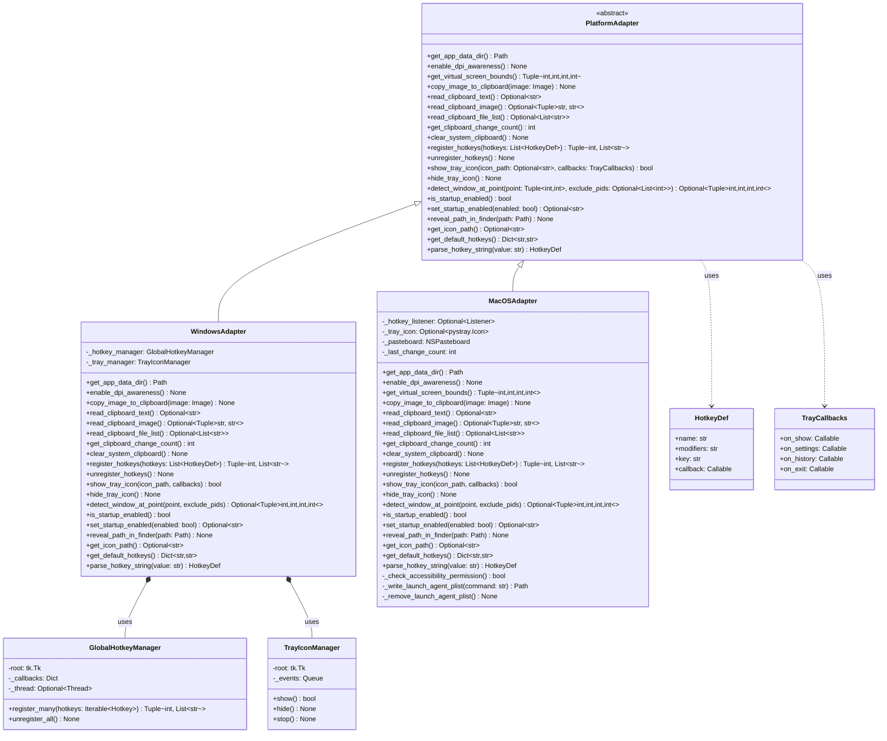
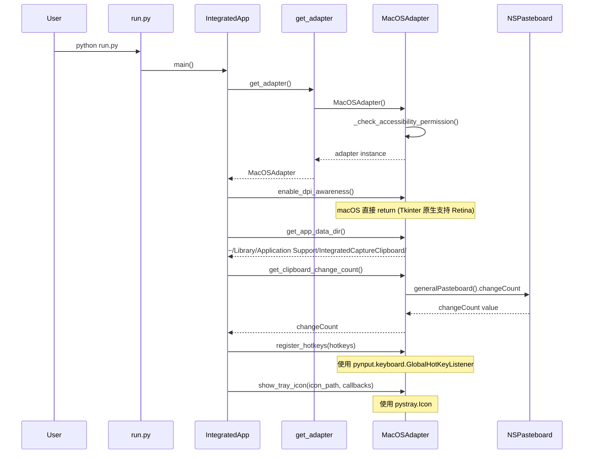
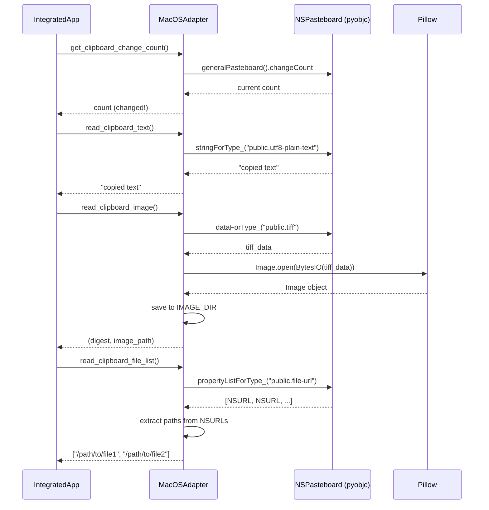
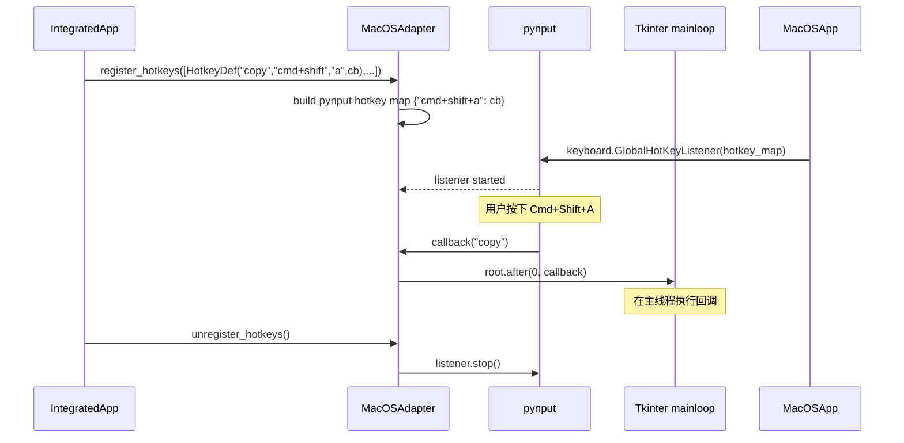
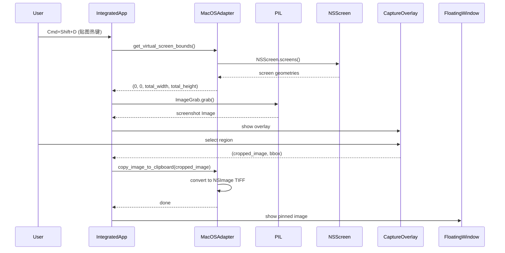
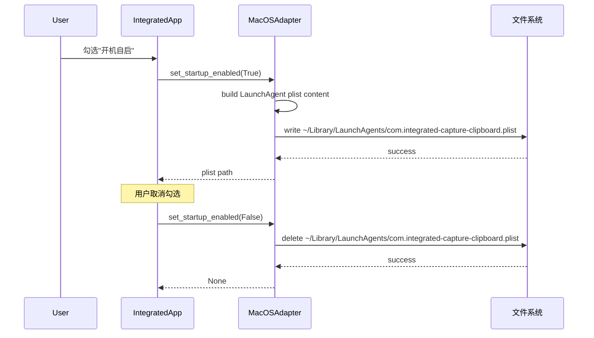
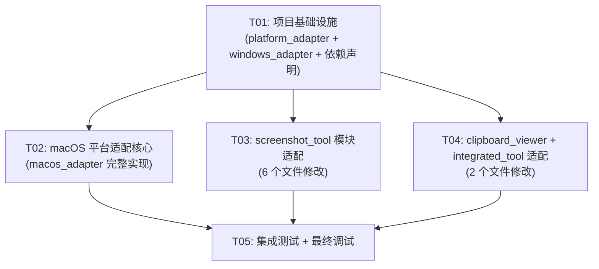

# ScreenshotClipboardTool macOS 适配 — 系统架构设计

> 架构师：高见远（Gao） | 版本：1.0 | 日期：2025-07

---

## 目录

- [Part A：系统设计](#part-a系统设计)
  - [1. 实现方案与框架选型](#1-实现方案与框架选型)
  - [2. 文件列表](#2-文件列表)
  - [3. 数据结构与接口（类图）](#3-数据结构与接口类图)
  - [4. 程序调用流程（时序图）](#4-程序调用流程时序图)
  - [5. 待明确事项](#5-待明确事项)
- [Part B：任务分解](#part-b任务分解)
  - [6. 依赖包列表](#6-依赖包列表)
  - [7. 任务列表](#7-任务列表)
  - [8. 共享知识](#8-共享知识)
  - [9. 任务依赖图](#9-任务依赖图)

---

## Part A：系统设计

### 1. 实现方案与框架选型

#### 1.1 核心技术挑战

| 挑战 | 说明 |
|------|------|
| **Win32 API 硬编码** | 8 个文件中有 `if sys.platform != "win32": return` 硬性平台限制，另有 `clipboard_viewer.py` 顶层直接 `ctypes.WinDLL()` 加载，macOS 上 import 即崩溃 |
| **剪切板 API 差异** | Windows 用 `OpenClipboard/GetClipboardData`，macOS 用 `NSPasteboard`；文件列表格式从 `CF_HDROP` 变为 `public.file-url` |
| **热键注册机制** | Windows 用 `RegisterHotKey` + 消息线程，macOS 用 `pynput` 事件监听，两者生命周期管理完全不同 |
| **窗口检测模型差异** | Windows 用 `EnumChildWindows` 逐步遍历，macOS 用 `CGWindowListCopyWindowInfo` 一次获取全部窗口信息 |
| **应用入口硬编码** | `integrated_tool/app.py` 的 `main()` 直接 `if os.name != "nt": raise SystemExit` |

#### 1.2 架构模式：ABC + 工厂方法

```
┌──────────────────────────────────────┐
│          业务调用层                    │
│  (app.py, clipboard_viewer.py 等)    │
│          ↓ 调用                       │
│    PlatformAdapter 接口 (ABC)         │
│          ↓ 工厂方法                   │
│   ┌────────────┬──────────────┐      │
│   │ Windows    │  macOS       │      │
│   │ Adapter    │  Adapter     │      │
│   └────────────┴──────────────┘      │
└──────────────────────────────────────┘
```

**关键设计决策**：

1. **一个统一接口文件 `platform_adapter.py`**，包含所有平台能力的抽象基类 `PlatformAdapter`，由各平台子模块实现
2. **工厂函数 `get_adapter() -> PlatformAdapter`**，根据 `sys.platform` 返回对应实现，业务代码零平台判断
3. **渐进式替换**：保留现有 Win32 代码不动，将平台逻辑提取到 `WindowsAdapter` 中；新增 `MacOSAdapter` 实现
4. **不引入过度抽象**：`PlatformAdapter` 只抽象已有平台差异点，不预设未来平台

#### 1.3 框架与库选型

| 能力 | Windows 现状 | macOS 方案 | 选型理由 |
|------|-------------|-----------|---------|
| 全局热键 | `user32.RegisterHotKey` | **`pynput`** | 封装好、维护活跃（v1.7+）、PyPI 可装、跨平台统一 API；CGEventTap 需要大量样板代码 |
| 剪切板读写 | `user32.OpenClipboard` / `kernel32.GlobalLock` | **`pyobjc-framework-Cocoa`** (`NSPasteboard`) | 原生 API、无需额外 CLI 工具、类型系统完整 |
| 剪切板变化监听 | `GetClipboardSequenceNumber` 轮询 | **`NSPasteboard.changeCount`** 轮询 | 同样是轮询模式，API 更简单 |
| 窗口检测 | `EnumChildWindows` / `DwmGetWindowAttribute` | **`pyobjc-framework-Quartz`** (`CGWindowListCopyWindowInfo`) | 一次调用获取全部窗口信息，比 Win32 更高效 |
| 系统托盘 | `Shell_NotifyIconW` (自实现) | **`pystray`**（已有依赖） | 项目已依赖 pystray，macOS 后端基于 rumps/PyObjC 可直接用 |
| 开机自启 | `winreg` 写注册表 | **LaunchAgent plist** (`~/Library/LaunchAgents/`) | macOS 标准机制，无需额外框架 |
| 屏幕捕获 | `ImageGrab.grab(all_screens=True)` | **`ImageGrab.grab()`** + `NSScreen` | Pillow 在 macOS 上原生支持；多屏需 `NSScreen` 获取几何信息 |
| DPI/Retina | `SetProcessDpiAwareness(2)` | **直接跳过** | Tkinter 原生支持 Retina |

### 2. 文件列表

#### 2.1 新增文件

| 相对路径 | 说明 |
|---------|------|
| `src/platform_adapter.py` | 跨平台抽象层：`PlatformAdapter` ABC + 工厂函数 `get_adapter()` |
| `src/macos_adapter.py` | macOS 平台适配实现：`MacOSAdapter` |
| `src/windows_adapter.py` | Windows 平台适配实现：`WindowsAdapter`（提取自现有 Win32 代码） |
| `assets/icon.icns` | macOS 应用图标（ICNS 格式，用于 .app Bundle） |
| `build_macos.sh` | macOS 构建脚本（PyInstaller + .app Bundle） |
| `docs/sequence-diagram.mermaid` | 时序图 Mermaid 源文件 |
| `docs/class-diagram.mermaid` | 类图 Mermaid 源文件 |

#### 2.2 需修改文件

| 相对路径 | 修改内容 |
|---------|---------|
| `src/clipboard_viewer.py` | 移除顶层 `ctypes.WinDLL()` 调用 → 改用 `platform_adapter`；`WindowsClipboard` / `read_unicode_text` / `read_file_list` / `read_dib_bytes` / `get_clipboard_sequence_number` 等函数 → 委托给 adapter；`enable_dpi_awareness` → 委托给 adapter |
| `src/screenshot_tool/app.py` | `enable_dpi_awareness()` → 委托给 adapter；`virtual_screen_bounds()` → 委托给 adapter；`iconbitmap` 调用 → 加平台保护 |
| `src/screenshot_tool/clipboard.py` | `copy_image_to_clipboard()` → 委托给 adapter |
| `src/screenshot_tool/hotkeys.py` | `GlobalHotkeyManager` → 改为调用 adapter 的热键接口；保留 `Hotkey` dataclass 但修改修饰键解析以支持 macOS 映射 |
| `src/screenshot_tool/tray.py` | `TrayIconManager` → 改为调用 adapter 的托盘接口（macOS 直接使用 pystray） |
| `src/screenshot_tool/window_detect.py` | `detect_window_rect_at_point()` → 委托给 adapter |
| `src/screenshot_tool/startup.py` | `is_startup_enabled()` / `set_startup_enabled()` → 委托给 adapter |
| `src/integrated_tool/app.py` | `main()` 移除 `os.name != "nt"` 硬性退出；`app_data_dir()` / `read_startup_value()` / `set_integrated_startup_enabled()` → 委托给 adapter；`parse_hotkey()` 修饰键映射支持 macOS；`reveal_recent_capture()` → 委托给 adapter |
| `pyproject.toml` | 添加 macOS 条件依赖 |
| `requirements.txt` | 添加 macOS 依赖说明 |

### 3. 数据结构与接口（类图）



#### 核心接口说明

**`HotkeyDef`** — 跨平台热键定义

```python
@dataclass(frozen=True)
class HotkeyDef:
    name: str           # 热键名称，如 "copy"
    modifiers: str      # 修饰键字符串，如 "cmd+shift" 或 "alt"
    key: str            # 按键，如 "a"
    callback: Callable   # 回调函数
```

- macOS 默认热键映射：`Alt+A` → `Cmd+Shift+A`
- `parse_hotkey_string()` 在各平台实现中将字符串解析为 `HotkeyDef`

**`TrayCallbacks`** — 托盘事件回调

```python
@dataclass
class TrayCallbacks:
    on_show: Callable[[], None]
    on_settings: Callable[[], None]
    on_history: Callable[[], None]
    on_exit: Callable[[], None]
```

**`get_adapter()`** — 工厂函数

```python
_adapter: Optional[PlatformAdapter] = None

def get_adapter() -> PlatformAdapter:
    global _adapter
    if _adapter is not None:
        return _adapter
    if sys.platform == "darwin":
        from macos_adapter import MacOSAdapter
        _adapter = MacOSAdapter()
    elif sys.platform == "win32":
        from windows_adapter import WindowsAdapter
        _adapter = WindowsAdapter()
    else:
        raise RuntimeError(f"Unsupported platform: {sys.platform}")
    return _adapter
```

### 4. 程序调用流程（时序图）

#### 4.1 应用启动流程



#### 4.2 剪切板读取流程



#### 4.3 全局热键注册流程



#### 4.4 截图+贴图流程



#### 4.5 开机自启设置流程



### 5. 待明确事项

| # | 问题 | 假设/倾向 | 风险 |
|---|------|----------|------|
| 1 | 辅助功能权限引导方式 | 首次启动时弹窗提示，提供"打开系统设置"按钮（使用 `subprocess.Popen(["open", "x-apple.systempreferences:..."])`） | 中 — 用户可能不理解权限用途 |
| 2 | 剪切板图片写入格式 | 同时写入 `public.tiff` 和 `public.png`（TIFF 兼容性最好，PNG 更通用） | 低 |
| 3 | `pystray` macOS 行为一致性 | 假设 `pystray` 在 macOS 上行为足够好；如果不行，回退到 `rumps` | 中 — 需要实际验证 |
| 4 | 打包方式 | 使用 PyInstaller 生成 `.app` Bundle（对 LaunchAgent 和辅助功能权限更友好） | 高 — PyInstaller macOS 支持需要验证 |
| 5 | 窗口检测功能 | 保留但简化 — macOS 用户可能不如 Windows 用户依赖此功能，但作为可选功能保留 | 低 |
| 6 | `clipboard_viewer.py` 重构范围 | 该文件超过 900 行且顶层直接加载 Win32 DLL，需要较大改动；本设计建议将剪切板读写逻辑全部移入 adapter，该文件只保留 GUI 和业务逻辑 | 高 — 改动量大 |
| 7 | 热键修饰键映射策略 | 用户配置中使用平台无关描述（如 `copy_key`），在 adapter 中映射为平台特定热键 | 中 — 需要设计配置迁移方案 |

---

## Part B：任务分解

### 6. 依赖包列表

#### macOS 新增依赖

```
- pynput>=1.7.6                # 全局热键监听（macOS/Windows/Linux 跨平台）
- pyobjc-framework-Cocoa>=10.0  # NSPasteboard 剪切板访问
- pyobjc-framework-Quartz>=10.0 # CGWindowListCopyWindowInfo 窗口检测 + NSScreen 多屏信息
- pyobjc-framework-LaunchServices>=10.0  # NSWorkspace 打开文件夹/文件定位（可选，也可用 subprocess）
```

#### 现有依赖（无需变更）

```
- Pillow>=10.0       # 图片处理（macOS 原生支持 ImageGrab）
- pystray>=0.19.0    # 系统托盘（macOS 后端可用）
```

#### 条件安装说明

`pyobjc-*` 和 `pynput` 仅在 macOS 上安装。在 `pyproject.toml` 中使用环境标记：

```toml
[project.optional-dependencies]
macos = [
    "pynput>=1.7.6",
    "pyobjc-framework-Cocoa>=10.0",
    "pyobjc-framework-Quartz>=10.0",
]
```

### 7. 任务列表

---

#### T01：项目基础设施 — 跨平台抽象层 + 依赖声明 + 构建脚本

- **Task ID**: T01
- **Priority**: P0
- **Dependencies**: 无
- **Source Files**:
  - `src/platform_adapter.py` （新建 — PlatformAdapter ABC + HotkeyDef + TrayCallbacks + get_adapter() 工厂函数）
  - `src/windows_adapter.py` （新建 — 提取自现有 Win32 代码的 WindowsAdapter）
  - `pyproject.toml` （修改 — 添加 macOS 可选依赖）
  - `requirements.txt` （修改 — 添加 macOS 依赖说明注释）
  - `build_macos.sh` （新建 — macOS 构建脚本）
  - `assets/icon.icns` （新建 — macOS 图标资源）
- **说明**:
  1. 定义 `PlatformAdapter` 抽象基类，包含第 3 节中所有抽象方法
  2. 定义 `HotkeyDef`、`TrayCallbacks` 数据类
  3. 实现 `get_adapter()` 工厂函数
  4. 创建 `WindowsAdapter`，将现有 `hotkeys.py` 的 `GlobalHotkeyManager`、`tray.py` 的 `TrayIconManager`、`clipboard.py` 的 Win32 剪切板逻辑、`window_detect.py` 的 Win32 窗口检测、`startup.py` 的注册表操作全部封装进来
  5. 更新 `pyproject.toml` 和 `requirements.txt`
  6. 创建 `build_macos.sh` 构建脚本模板

---

#### T02：macOS 平台适配核心实现

- **Task ID**: T02
- **Priority**: P0
- **Dependencies**: T01
- **Source Files**:
  - `src/macos_adapter.py` （新建 — MacOSAdapter 完整实现）
- **说明**:
  1. 实现 `MacOSAdapter` 所有抽象方法：
     - `get_app_data_dir()` → `~/Library/Application Support/IntegratedCaptureClipboard/`
     - `enable_dpi_awareness()` → 直接 return
     - `get_virtual_screen_bounds()` → 通过 `NSScreen.screens()` 获取屏幕几何信息拼接
     - `copy_image_to_clipboard()` → `NSPasteboard.clearContents()` + `NSImage` 写入 TIFF+PNG
     - `read_clipboard_text()` → `NSPasteboard.stringForType_("public.utf8-plain-text")`
     - `read_clipboard_image()` → `NSPasteboard.dataForType_("public.tiff")` + PIL 解析
     - `read_clipboard_file_list()` → `NSPasteboard.propertyListForType_("public.file-url")` + NSURL 路径提取
     - `get_clipboard_change_count()` → `NSPasteboard.generalPasteboard().changeCount`
     - `clear_system_clipboard()` → `NSPasteboard.clearContents()`
     - `register_hotkeys()` → `pynput.keyboard.GlobalHotKeyListener` 监听
     - `unregister_hotkeys()` → `listener.stop()`
     - `show_tray_icon()` → `pystray.Icon` 创建与运行
     - `hide_tray_icon()` → `icon.stop()`
     - `detect_window_at_point()` → `CGWindowListCopyWindowInfo` + 窗口边界/层级过滤
     - `is_startup_enabled()` / `set_startup_enabled()` → LaunchAgent plist 读写
     - `reveal_path_in_finder()` → `subprocess.Popen(["open", "-R", str(path)])`
     - `get_icon_path()` → PNG 图标路径
     - `get_default_hotkeys()` → `{"copy":"Cmd+Shift+A", "edit":"Cmd+Shift+S", "pin":"Cmd+Shift+D", "show":"Cmd+Shift+M"}`
     - `parse_hotkey_string()` → 解析修饰键字符串（支持 cmd/option/shift/control）
  2. 实现 `_check_accessibility_permission()` 辅助功能权限检查
  3. 实现 `_write_launch_agent_plist()` / `_remove_launch_agent_plist()`

---

#### T03：业务层适配 — screenshot_tool 模块

- **Task ID**: T03
- **Priority**: P0
- **Dependencies**: T01
- **Source Files**:
  - `src/screenshot_tool/app.py` （修改 — 替换 Win32 调用为 adapter 调用）
  - `src/screenshot_tool/clipboard.py` （修改 — `copy_image_to_clipboard` 委托给 adapter）
  - `src/screenshot_tool/hotkeys.py` （修改 — `GlobalHotkeyManager` 委托给 adapter 热键接口）
  - `src/screenshot_tool/tray.py` （修改 — `TrayIconManager` 委托给 adapter 托盘接口）
  - `src/screenshot_tool/window_detect.py` （修改 — `detect_window_rect_at_point` 委托给 adapter）
  - `src/screenshot_tool/startup.py` （修改 — `is/set_startup_enabled` 委托给 adapter）
- **说明**:
  1. `app.py`：将 `enable_dpi_awareness()` 和 `virtual_screen_bounds()` 改为调用 `get_adapter().enable_dpi_awareness()` / `get_adapter().get_virtual_screen_bounds()`；`iconbitmap` 调用加 `try/except TclError` 保护或条件判断
  2. `clipboard.py`：`copy_image_to_clipboard()` 改为 `get_adapter().copy_image_to_clipboard(image)`，移除内部 Win32 代码
  3. `hotkeys.py`：`GlobalHotkeyManager.register_many()` 改为调用 `get_adapter().register_hotkeys()`，移除内部 `_message_loop` Win32 线程逻辑；保留 `Hotkey` dataclass 兼容层
  4. `tray.py`：`TrayIconManager` 改为调用 `get_adapter().show_tray_icon()` / `hide_tray_icon()`，移除 Win32 窗口过程逻辑
  5. `window_detect.py`：`detect_window_rect_at_point()` 改为调用 `get_adapter().detect_window_at_point()`，移除 Win32 窗口枚举逻辑
  6. `startup.py`：`is_startup_enabled()` / `set_startup_enabled()` 改为调用 `get_adapter().is_startup_enabled()` / `set_startup_enabled()`

---

#### T04：业务层适配 — clipboard_viewer + integrated_tool 模块

- **Task ID**: T04
- **Priority**: P0
- **Dependencies**: T01
- **Source Files**:
  - `src/clipboard_viewer.py` （修改 — 移除顶层 Win32 DLL 加载，剪切板操作委托给 adapter）
  - `src/integrated_tool/app.py` （修改 — 移除平台硬限制，启动/数据目录/热键/文件定位等委托给 adapter）
- **说明**:
  1. `clipboard_viewer.py`：
     - 移除顶层 `kernel32 = ctypes.WinDLL(...)` 等 6 行 Win32 DLL 加载
     - 移除 `WindowsClipboard` 上下文管理器、`format_available()`、`read_unicode_text()`、`read_file_list()`、`read_dib_bytes()` 等函数中的 Win32 代码
     - 替换为 `get_adapter().read_clipboard_text()` / `read_clipboard_image()` / `read_clipboard_file_list()` / `get_clipboard_change_count()` / `clear_system_clipboard()`
     - `enable_dpi_awareness()` 委托给 adapter
     - 保留所有 GUI 逻辑不变
  2. `integrated_tool/app.py`：
     - `main()` 移除 `if os.name != "nt": raise SystemExit`
     - `app_data_dir()` → `get_adapter().get_app_data_dir()`
     - `read_startup_value()` / `is_integrated_startup_enabled()` / `set_integrated_startup_enabled()` → `get_adapter().is_startup_enabled()` / `set_startup_enabled()`
     - `parse_hotkey()` → `get_adapter().parse_hotkey_string()`
     - `reveal_recent_capture()` → `get_adapter().reveal_path_in_finder(path)`
     - `DEFAULT_HOTKEYS` → `get_adapter().get_default_hotkeys()`
     - `current_startup_command()` / `quote_windows_path()` → 移入 `WindowsAdapter`

---

#### T05：集成测试 + 最终调试

- **Task ID**: T05
- **Priority**: P0
- **Dependencies**: T02, T03, T04
- **Source Files**:
  - `src/platform_adapter.py` （微调 — 根据集成测试修复接口）
  - `src/macos_adapter.py` （微调 — 修复集成中发现的问题）
  - `src/screenshot_tool/app.py` （微调 — 修复 iconbitmap 等边界问题）
  - `src/integrated_tool/app.py` （微调 — 修复入口逻辑）
  - `docs/architecture-macos-adaptation.md` （更新 — 记录实际变更）
- **说明**:
  1. 在 macOS 环境执行端到端测试：
     - 应用启动 → 无崩溃
     - 剪切板读取（文本/图片/文件列表）→ 正确
     - 剪切板变化监听 → 正确触发
     - 全局热键注册与回调 → 正确触发
     - 系统托盘显示与菜单 → 正常工作
     - 截图功能（全屏/区域选择）→ 正确
     - 贴图功能 → 正确显示
     - 开机自启设置 → plist 正确写入/删除
     - 窗口检测 → 返回正确边界
     - "打开所在文件夹" → Finder 正确打开
  2. 在 Windows 环境回归测试确保无破坏
  3. 修复集成中发现的所有问题
  4. 更新架构文档记录实际变更

---

### 8. 共享知识

```
- 平台适配器单例：get_adapter() 返回全局唯一实例，所有模块通过此函数获取
- 剪切板图片存储格式：macOS 上保存为 PNG（从 NSPasteboard 读取 TIFF 后转换）
- 剪切板变化检测：统一使用轮询模式（Windows: GetClipboardSequenceNumber, macOS: NSPasteboard.changeCount）
- 全局热键回调：统一通过 root.after(0, callback) 在 Tkinter 主线程执行，避免线程安全问题
- 热键修饰键命名：配置文件中使用平台无关的字符串（如 "alt+a"），由各平台 adapter 解析映射
- 数据目录路径：Windows: %APPDATA%/IntegratedCaptureClipboard, macOS: ~/Library/Application Support/IntegratedCaptureClipboard/
- 图标文件：Windows 使用 .ico，macOS 使用 .png；代码中通过 adapter.get_icon_path() 获取
- iconbitmap 调用：macOS Tkinter 不支持 iconbitmap()，所有调用必须 try/except TclError 保护
- 所有路径操作统一使用 pathlib.Path，不使用字符串拼接
- 应用名称常量：APP_NAME = "IntegratedCaptureClipboard"，macOS Bundle ID: "com.integrated-capture-clipboard"
- LaunchAgent plist 路径：~/Library/LaunchAgents/com.integrated-capture-clipboard.plist
- 辅助功能权限：macOS 全局热键需要用户在「系统设置 > 隐私与安全性 > 辅助功能」中授权应用
```

### 9. 任务依赖图



**说明**：T02、T03、T04 三个任务在 T01 完成后可以**并行开发**，它们之间没有依赖关系。T05 需要等待前三个全部完成。
